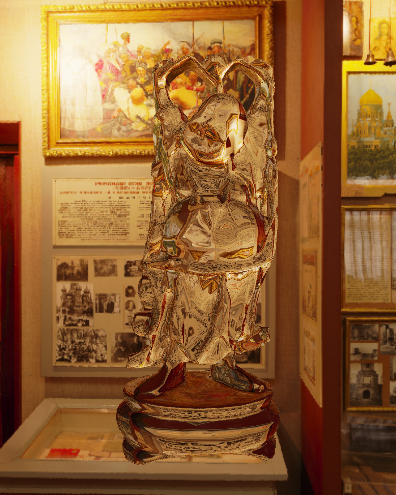
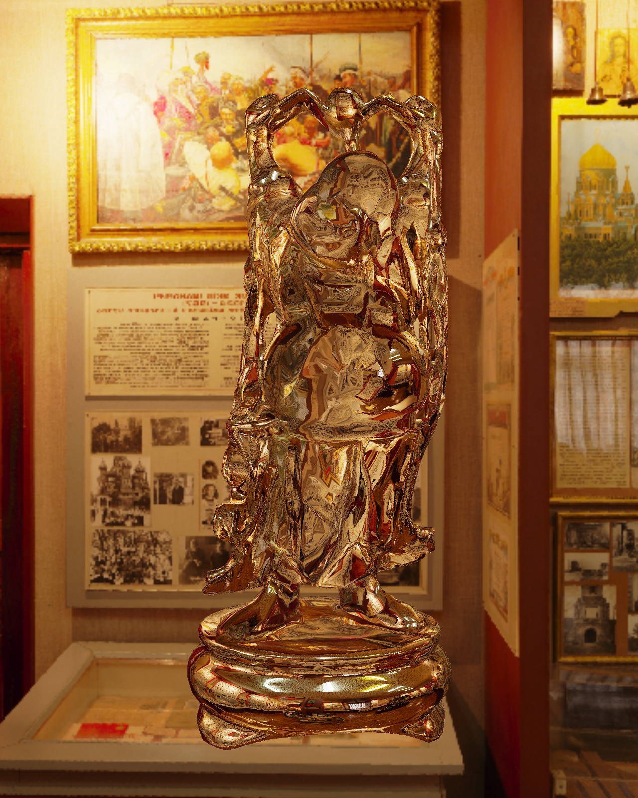
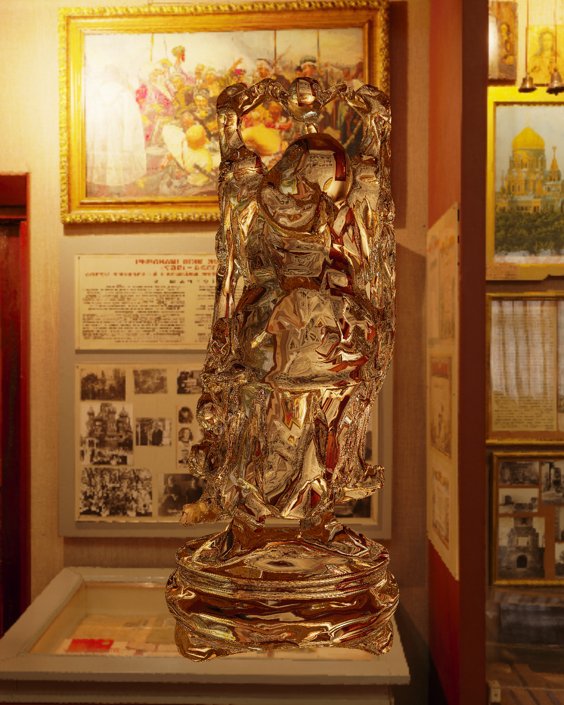

# RayTracingGLSL
Implementing a 4-bounce path tracer in GLSL as part of my final project for Real-time Rendering at Trinity College Dublin. This repository goes side-by-side with my other final project repo: "TCD_RealtimeRendering_FinalProject".

The full project desciption is: This is my final assignment of CS7GV3: Real-time Rendering at Trinity College Dublin. My project was based on Chris Wyman's 2005 SIGGRAPH paper entitled  "An Approximate Image-Space Approach for Interactive Refraction" (https://cwyman.org/papers/sig05_approxISRefr.pdf). Wyman proposed a method to perform refraction through two surfaces which provides a far more physically accurate rendering of light refraction through convex 3D models than the trivial and widely adopted one-surface refraction method. I implemented a two-pass rendering approach to Wyman's paper. The first pass rendered only the back faces of the model and stored the depth and encoded surface normals in textures. The second pass rendered the front faces and made use of the textures generated in the first pass to find the exit point of the ray and the surface normal at that point. This implementation achieved frame rate performance north of 300 FPS for 5 different models of various polygon counts and surface complexities. The single surface refraction method achieved average frame rates of above 500 FPS on the same 5 models and skyboxes, but visually it lacked physical accuracy. The skybox cubemaps used in this project consisted of six 1024x1024 images.

This path-tracing algorithm served as a ground-truth representation of the 3D models in the scene against which my refraction implementations were compared.

<table>
  <tr>
    <td></td>
    <td></td>
    <td></td>
  </tr>
</table>

<table>
  <tr>
    <td></td>
    <td></td>
    <td></td>
  </tr>
</table>

All code was written in OpenGL C++. All shaders were written in GLSL.

YouTube demonstration video: https://www.youtube.com/watch?v=3ZKZjqSln1w
